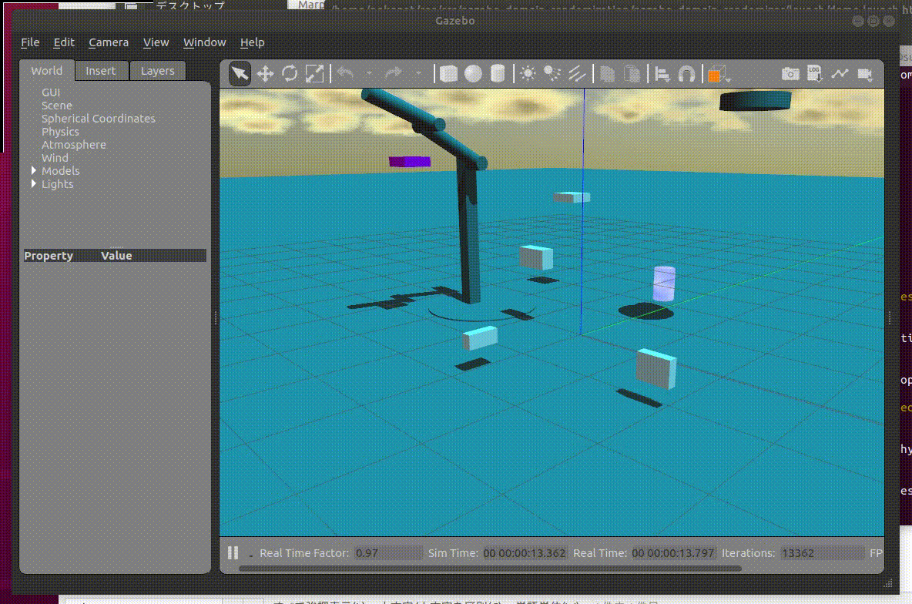
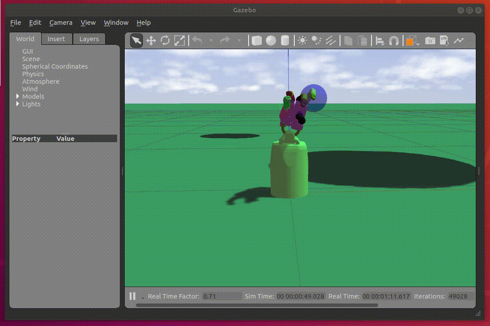

# Gazebo Domain Randomization

[](https://travis-ci.org/neka-nat/gazebo_domain_randomization)

https://arxiv.org/abs/1703.06907

**Double pendulum demo**



**Shadow hand demo**



## Run

```
roslaunch gazebo_domain_randomizer demo.launch
```

If you want to randomize with external trigger, execute with the following option.

```
roslaunch gazebo_domain_randomizer demo.launch event_mode:='trigger'
```

And please execute the following command on another console.

```
rostopic pub /randomizers/randomizer/trigger std_msgs/Empty "{}"  -r 1.0
```

## Settings
To use the randamizers, you need to make the following two settings.

1. For physics parameters randomization, set *physics_plugin* (WorldPlugin) in the world file.

```xml
<sdf version="1.6">
  <world name="default">
    <include>
      <uri>model://sun</uri>
    </include>
    <include>
      <uri>model://ground_plane</uri>
    </include>
    ...
    <plugin name="physics_plugin" filename="libgazebo_physics_plugin.so"/>
  </world>
</sdf>
```

2. For visual randomization, you need to load *scene_plugin* (SystemPlugin) for gzclient. Therefore, please use the gzclient script in gazebo_domain_randomizer package. It configures to load the system plugin in the script.

```xml
<launch>
  ...
  <include file="$(find gazebo_ros)/launch/empty_world.launch">
    <arg name="gui" value="false" />
  </include>
  <node name="gazebo_gui" pkg="gazebo_domain_randomizer" type="gzclient" respawn="false" output="screen" />
  ...
</launch>
```

## Randomizers

|Node name |Randomized parameter|
| -------- | -------------------- | 
| **light_randomizer** | - light color </br> - attenuation |
| **shape_randomizer** | - shape(sphere, box, cylinder) </br> - shape color </br> - position(x, y, z) |
| **sky_randomizer** | - time of day |
| **physics properties randomizer** | - gravity(x, y, z) |
| **link_properties_randomizer** | - link mass |
| **joint_properties_randomizer** | - joint damping |
| **link_visual_properties_randomizer** | - link color |
| **surface_params_randomizer** | - link mu1, mu2, mu_torsion </br> - link poisson ratio |
